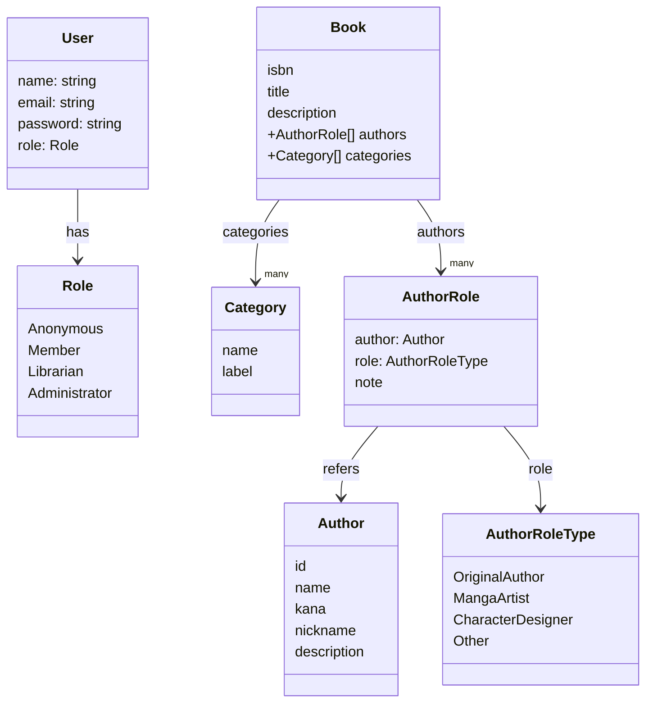

## 簡易クラス図

依存関係を表しただけ。

```mermaid
classDiagram

    class Role {
        Anonymous
        Member
        Librarian
        Administrator
    }
    class User {
        name: string
        email: string
        password: string
        role: Role
    }

    User --> Role : has

    class Category {
        name
        label
    }
    class Author {
        id
        name
        kana
        nickname
        description
    }
    class AuthorRole {
        author: Author
        role: AuthorRoleType
        note
    }
    class AuthorRoleType {
        OriginalAuthor
        MangaArtist
        CharacterDesigner
        Other
    }
    class Book {
        isbn
        title
        description
        +AuthorRole[] authors
        +Category[] categories
    }

    Book --> "many" AuthorRole : authors
    AuthorRole --> Author : refers
    AuthorRole --> AuthorRoleType : role
    Book --> "many" Category : categories
```
